<!-- ============================================================ -->
<!-- HERO  (animated, theme-aware — see assets/hero-*.svg)         -->
<!-- ============================================================ -->

<picture>
  <source media="(prefers-color-scheme: dark)" srcset="./assets/hero-dark.svg">
  <source media="(prefers-color-scheme: light)" srcset="./assets/hero-light.svg">
  
</picture>

 
 

---

## Now

&bull; **Research Assistant**, Center for the Future of Higher Education and Work (CHEW), Northeastern: full-stack redesign and data-ingestion automation for a higher-education compliance web application 
&bull; **Research Assistant** for Dr. Rominder Singh, Northeastern: building **RA Copilot**, a Canvas-embeddable RAG tutor for Regulatory Affairs; earlier built the Global Drug Regulatory RAG dataset pipeline 
&bull; Shipping **DiaFoot.AI v2** and co-authoring a diabetic-foot-ulcer segmentation manuscript (in progress) with a Harvard collaborator, targeting SPIE Medical Imaging 
&bull; Exploring agentic AI systems, retrieval-augmented generation and graph learning 
&bull; Open to AI / ML **internship, co-op, and full-time** opportunities

---

## Featured Projects

### DiaFoot.AI &middot; Diabetic Foot Ulcer Intelligence &nbsp;(solo)
A cascaded, multi-task computer-vision pipeline for diabetic foot images: a DINOv2 ViT-B/14 triage classifier (LoRA fine-tuned) &rarr; UPerNet wound segmenter &rarr; wound-area measurement in mm&sup2;, with image-quality gates and a defer-to-clinician path. Reaches **98.4% triage accuracy**, **0.999 macro-AUROC** and **DFU-only Dice 0.891** on leakage-audited splits, with an ONNX export validated at **99.99% mask parity** and **4.5x faster** inference. Trained on NVIDIA **B200** (MGHPCC) and **H200** (Northeastern Explorer) via SLURM.

`PyTorch` `DINOv2` `UPerNet` `LoRA` `ONNX` `FastAPI` `SLURM` &nbsp;&middot;&nbsp; [Repository](https://github.com/Ruthvik-Bandari/DiaFoot.AI)

### RA Copilot &middot; RAG Tutor for Regulatory Affairs &nbsp;(research, with Om Patel)
A Canvas-embeddable text-and-voice RAG tutor running a five-stage **route &rarr; retrieve &rarr; generate &rarr; ground &rarr; frame** pipeline over a 611-chunk course knowledge base and an 11-module / 70-topic curriculum map. Hybrid retrieval (pgvector dense + BM25) with optional cross-encoder reranking and LettuceDetect / MiniCheck groundedness checks; a ports-and-adapters backend with a config-only GPU-to-CPU serving switch (vLLM + Qwen3). **201 passing backend tests** plus Playwright end-to-end coverage.

`FastAPI` `pgvector` `BM25` `vLLM` `Qwen3` `React` `LTI 1.3`

### Global Drug Regulatory RAG Dataset Pipeline &nbsp;(research)
A healthcare regulatory-intelligence pipeline spanning **199 countries and 200 authorities**. A five-stage clean &rarr; normalize &rarr; enrich &rarr; validate &rarr; export flow with a classifier and SimHash dedup gate produces **59,284 semantic chunks** across 9,321 validated documents (195/200 ISO codes reachable), backed by **539+ tests**.

`Python` `BeautifulSoup4` `httpx` `SimHash` `langdetect`

### Research Aggregation Pipeline &middot; IEEE TechRxiv &nbsp;(team)
A multi-source academic aggregator (arXiv, BioRxiv, PubMed, Google News) rebuilt in clean OOP with retrying abstract scrapers and TF-IDF + K-means clustering with automatic K selection. The rewrite hit a **73.8x speedup** (571.7s &rarr; 7.8s) and 3.3x finer clustering versus the manual baseline. Published on IEEE TechRxiv.

`Python` `scikit-learn` `NLTK` `BeautifulSoup4` &nbsp;&middot;&nbsp; [Repository](https://github.com/Ruthvik-Bandari/Research_aggeregation_pipeline) &nbsp;&middot;&nbsp; [Paper](https://doi.org/10.36227/techrxiv.177040642.26830215/v1)

### CTPPO &middot; Cyber Threat Prioritization with PPO
GraphSAGE + DistilBERT + Dueling DQN over **276,049 CVEs** to learn and rank cyber-threat remediation paths.

`Python` `PyTorch` `PyTorch Geometric` `Transformers` `Stable-Baselines3`

---

## Tech Stack

**Languages**

  
  

**AI / ML / Deep Learning**

  
  
  
  
  

**LLMs / RAG / Agents**

  
  
  
  
  

**Data & MLOps**

  
  
  
  
  
  
  

**Backend & Frontend**

  

**DevOps / HPC / Tools**

  
  
  

---

## Publications

| Title | Venue | Year | Link |
|---|---|---|---|
| Automating Research Intelligence: AI-Generated vs Manually Designed Pipelines | IEEE TechRxiv | 2026 | [DOI](https://doi.org/10.36227/techrxiv.177040642.26830215/v1) |
| NeuroFace Recognition System | IOSR Journal of Computer Engineering, Vol. 27 Issue 2 | 2025 | [Journal](https://www.iosrjournals.org/) |

---

## Achievements

| Achievement | Year |
|---|---|
| Best AI Innovation Award &middot; Lahey CARE-AI-THON | 2026 |
| Runner-Up &middot; BASE 44 Hackathon | 2026 |
| Finalist &middot; Subconscious AI &times; ACM Hackathon | 2025 |
| ACM Student Chapter Lead | 2022&ndash;2025 |
| Class Representative (4 years) | 2021&ndash;2025 |

---

## GitHub Stats

 

 
 

<picture>
  <source media="(prefers-color-scheme: dark)" srcset="https://raw.githubusercontent.com/Ruthvik-Bandari/Ruthvik-Bandari/output/github-snake-dark.svg">
  <source media="(prefers-color-scheme: light)" srcset="https://raw.githubusercontent.com/Ruthvik-Bandari/Ruthvik-Bandari/output/github-snake.svg">
  
</picture>

---

### Let's build something that matters

